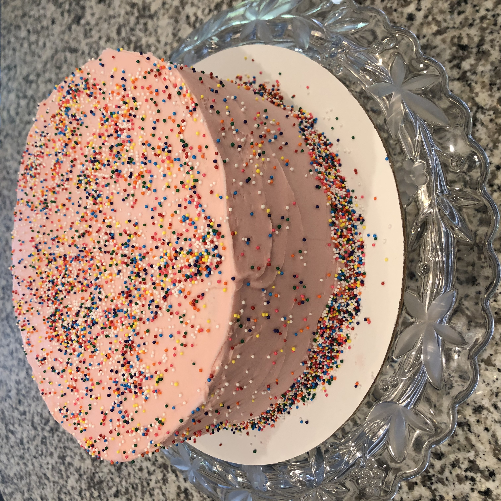

This recipe originally appeared on [Preppy Kitchen](https://preppykitchen.com/raspberry-buttercream/).

Pictured: [lemon cake](./lemon-cake) with raspberry buttercream.

### Ingredients

-   1 c raspberries
-   3 tbsp lemon juice
-   1 lb confectioner's sugar
-   1 c unsalted butter room temperature

### Instructions

Add raspberries and lemon juice to a saucepan over medium heat. After the mixture heats up for a few minutes, mash the raspberries then allow it to simmer for about 10 minutes.

Strain mixture into a bowl. Cover and chill.

Cream the room temperature butter for a few minutes.

Beat in the confectioner’s sugar and add in a tablespoon at a time of the raspberry reduction until the desired color and consistency is reached.

### Notes

