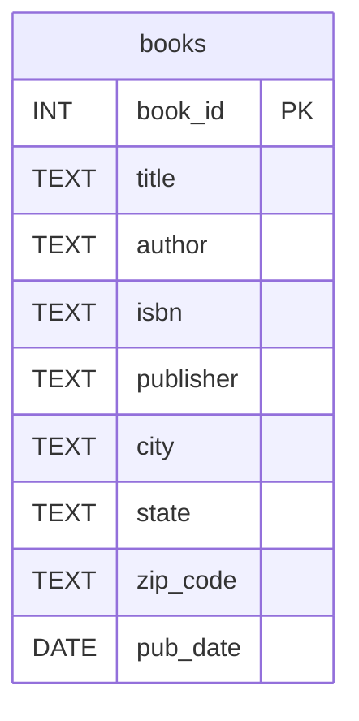
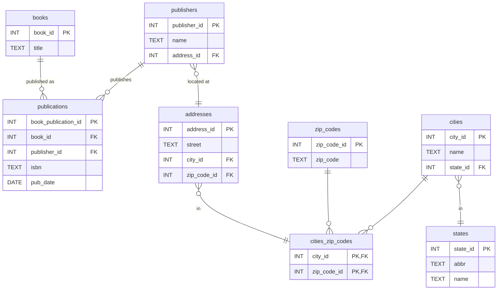

You've seen this table. You saw it in your intro to databases course. You saw it in the textbook. You've probably built some version of it.

It's clean. It's readable. Your professor put it on a slide and said "this is a normalized table." You studied. You learned. You passed the exam. You carried that mental model into your career.

It's wrong. Not subtly wrong. Not "well, it depends on the use case" wrong. It's just plain, without question, not up for debate wrong. It violates the very normalization rules it was supposed to teach you.

Let's talk about it.

## A quick refresher you probably need

Normalization isn't magic. It's a small set of rules that, when followed, prevent your data from contradicting itself. The objective is simple: **do not store the same fact in two places**. Doing so is a guarantee that those places will eventually disagree. Then, you don't have a database; you have a debate-a-base. (OK, I'll work on it.)

Here's the short version.

**First Normal Form (1NF):** Every column holds a single, atomic value. No lists, no repeating groups, no comma-separated anything. One value, one cell.

**Second Normal Form (2NF):** Every non-key column depends on the _entire_ primary key, not just part of it. This only matters when you have a composite key, but when you do, it matters a lot.

**Third Normal Form (3NF):** No non-key column depends on another non-key column. Every fact in the row is about the key, the whole key, and nothing but the key. If column B determines column C, then C doesn't belong in this table. It belongs in a table keyed by B.

There's a mnemonic: _the key, the whole key, and nothing but the key, [so help me Codd](https://en.wikipedia.org/wiki/Third_normal_form)._

Three rules. Your professor taught you these rules, then showed you a schema that breaks at least two of them.

## The textbook schema, under the microscope

Let's take a finer look at that `books` table.

Start with the obvious one. A `city` belongs to a `state`, not to a book. The `city` is a fact about geography, not a fact about a book. If the publisher is in Chicago, that's in Illinois. That dependency exists whether or not the book is ever written. This is a textbook (pun intended) 3NF violation. A non-key column depending on another non-key column.

But it gets worse.

`zip_code` has a many-to-many relationship with `city`. Large cities can have multiple ZIP codes, **and** ZIP codes can span multiple cities. U.S. geography can be weird like that.

We're still not done.

`publisher` determines the city, state, and ZIP code. Those aren't facts about the book. They're facts about the publisher. They belong in a `publishers` table, joined by a foreign key. Instead, they're sitting inline, which means every book published by the same publisher duplicates the publisher's address. Update it in one place, forget it in another. Congratulations, your data is lying to you.

While we're here: `pub_date` and `isbn` don't belong on this table either. A book can be published multiple times — different editions, different publishers, different dates, different ISBNs. _The Hobbit_ was published in 1937 by Allen & Unwin, and again in 1966 by Ballantine, and roughly a hundred times since. `pub_date` isn't a fact about the book. It's a fact about a _publication event_. That's its own table.

This single table violates 3NF in at least four different ways. The example used to teach normalization isn't normalized. The professor is failing his own class.

## You're doing this too

Go look at your own schemas. How many tables in your production database have columns `city`, `state`, `zip_code` sitting side by side?

I already know the answer. It's most of them. Damn my eyes.

"But it's just an address. It's not that complicated."

It's not complicated until a city straddles two ZIP codes. Until a ZIP code crosses a state line — and yes, [that happens](https://en.wikipedia.org/wiki/List_of_ZIP_Code_prefixes). Then, the post office reassigns a ZIP code and half your rows say one thing and half say another. Until you're running a report that joins on city name and you find out you have "St. Louis", "St Louis", "Saint Louis", and "St. Louis " (with a trailing space) all referring to the same place.

These aren't hypotheticals. These are any random Tuesday in Data Land. (Worst theme park ever, BTW.)

## The cost of getting it wrong

In a toy database, none of this matters. You have fifty rows and one developer. Denormalization is a rounding error. Nobody's going to die because your class project has `city` and `state` in the same table.

But you're not building a class project, are you? You're all up in my enterprise.

Enterprise data has this nasty habit of being load-bearing. It drives revenue. It drives internal policy and external compliance. It drives decisions that cost real money when they're based on garbage data. When your `orders` table says a shipment went to Indianapolis, Indiana, but your `shipments` table says it went to Indianapolis, Ohio (which doesn't exist, but your shitty schema didn't stop you), someone downstream is going to have a bad day.

_Oh! In 2026, your AI strategy is built on your data strategy, and your data strategy is a hot mess, so... But that's a different article._

The fix isn't exotic. Learn the rules. **Don't store derived facts**. Store the key. Look up the rest.

Is it more tables? Yes. Is it more joins? Yes. Is it the correct representation of how books and U.S. geography actually work? Also yes. And that matters more than how clean it looks on your professor's slide.

Every table has a clear purpose. The `books` table stores facts about books. The `publishers` table stores facts about publishers. The `publications` table stores facts about publications, and that's where the ISBN and the date actually live. The geography tables model the real many-to-many relationship between cities and ZIP codes. No column depends on anything other than its own primary key.

## Why they taught it wrong

I don't think professors are stupid. I think they're optimizing for the wrong thing.

A schema that fits on a slide is optimized for teaching. It's designed to be graspable in a 50-minute lecture by someone who has never seen a `JOIN`. And for that purpose, it's fine. You have to start somewhere.

The problem is that nobody comes back and says, "Now let's look at why that example was wrong." There's no second lecture titled "Everything I Told You Last Week Was a Simplification, and Here's What the Real World Looks Like." You pass the exam. You get the degree. You go build production systems with the mental model from slide 14 of week 3.

Fifteen years later, you're a senior developer, and your schemas still look like that slide. Not because you're incompetent, but because nobody ever challenged the assumption. The textbook said it was normalized. You believed the textbook.

## But what about my shipping labels?

Fair. Let's talk about when flat is correct.

You might have a `shipping_labels` table with `city`, `state`, and `zip_code` sitting right there in the same row, and that is correct. In this case, those columns aren't derived facts about geography. They're the actual values that were printed on an actual label that went on an actual box. The label is the fact. If someone fat-fingered the ZIP code, the label still said what it said. You're not storing where Indianapolis is; you're storing what the label read when it went out the door.

That's not denormalization. **That's correct data modeling.** The data is about the label, and the label had those values. Every column depends on the primary key — `label_id` — and nothing else.

The difference matters. When `city` appears in your `publishers` table, it's a derived fact about geography that's going to rot the moment the publisher moves. When `city` appears in your `shipping_labels` table, it's a historical record of what happened. One is a normalization violation. The other is the schema doing its job.

Knowing the difference is the whole point.

## We haven't even gotten to the hard parts

Data modeling is hard.

Everything above is just normalization. This is the stuff your textbook was supposed to teach you.

How do you uniquely identify an author? "John Smith." Which one? Authors change names. Authors use pen names. Samuel Clemens is Mark Twain. A corporate author isn't a person. What about multiple authors or ghost writers? This is entity resolution, one of the genuinely hard problems in data modeling, and library science has been wrestling with it for decades. The Library of Congress maintains [authority files](https://authorities.loc.gov/) just to answer the question "is this the same person?" There are global standards for this. (See also: [ISNI](https://isni.org/), [VIAF](https://viaf.org/).) They exist because a `TEXT` column named `author` was never going to cut it.

And ISBN? That's not just a unique identifier. ISBN ranges are [assigned to publishers](https://en.wikipedia.org/wiki/International_Standard_Book_Number#Registration_group_identifier). The identifier itself encodes information about who published the book. It's not a dumb key; it's a structured code with semantics, and if you're treating it as an opaque string, you're throwing away information.

None of this was on the exam. But all of it shows up the moment you try to build something real.

It's not your fault for not knowing as a fresh-faced junior developer, degree in one hand and eagerness in the other. But if you're a mid-level or senior engineer, I expect this to be foundational understanding.

## So what now?

I'm not going to tell you to go refactor every table in your production database. It's not worth it, and you'll break every downstream dependency.

But I will tell you this: the next time you design a schema, stop and look at your non-key columns. For each one, ask: does this column depend on the primary key, or does it depend on another column? If it depends on another column, it doesn't belong here. Extract it. Make a new table. Write the join.

It's more work upfront. It's less work forever after. That's the whole deal with normalization. You pay up front at design time to avoid paying an enormous tax every time your data contradicts itself and someone has to redefine truth.

The schema on the slide was designed to be **teachable**. Your production system was supposed to be designed to be **correct**. Know the difference.

And then, go build a goddamn view with `city`, `state`, `zip_code` so you don't need to think about it again.

---

Photo by [Berna](https://www.pexels.com/photo/diverse-collection-of-books-on-display-33305547/).
